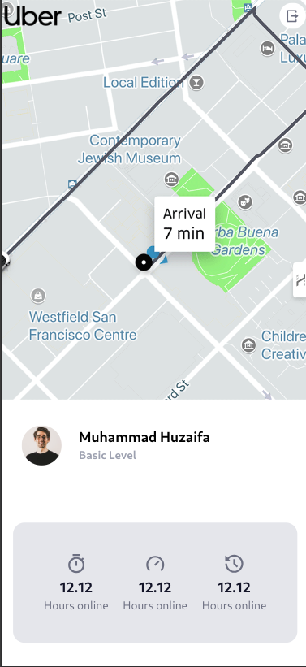
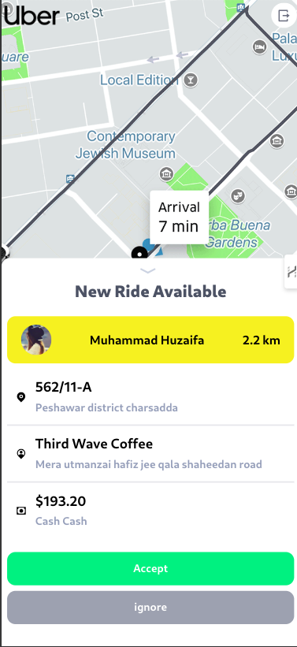
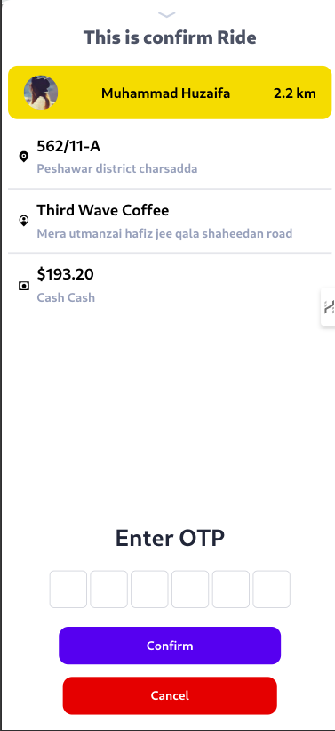

# UberClone

## User Signup
New users can create an account by providing their email, password, and other required details. This process ensures a smooth onboarding experience.

### Screenshot:

---

## User Login
Existing users can securely log in using their email and password. This section provides authenticated access to the platform.

### Screenshot:

---

## Captain Sign-In
Captains (drivers) can log in to their accounts using their credentials to start accepting ride requests.

### Screenshot:

---

## Captain Signup
New captains can register to join the service by submitting necessary details such as their driving license, vehicle information, and required documents.

### Screenshot:

---

## Additional Screenshots
### Captain Home

### New Ride Request

### Ride Confirmation

